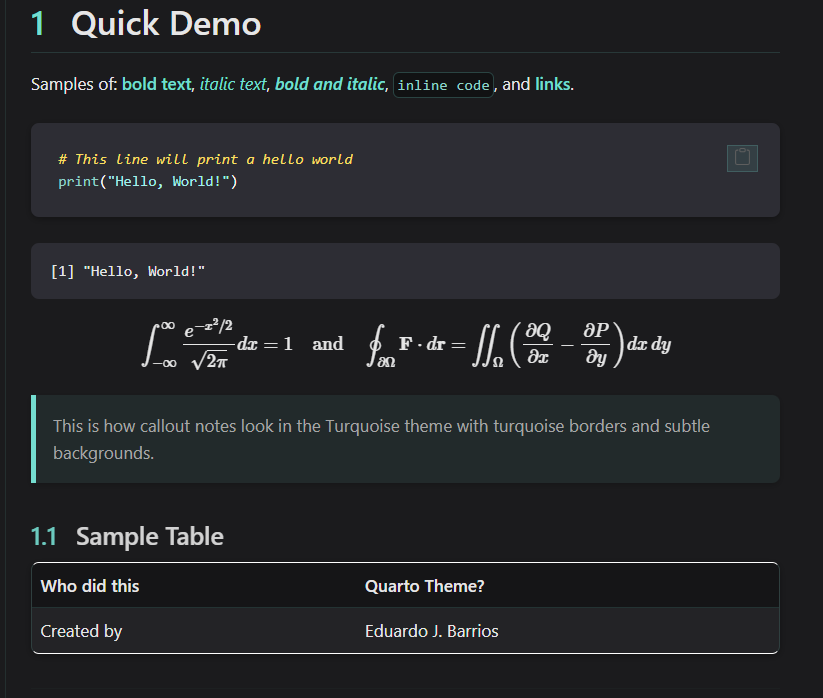

# Turquoise Theme for Quarto

A professional turquoise dark them dark theme for Quarto inspired by the personal branding colors of [edujbarrios](https://github.com/edujbarrios).

**Perfect for research papers, technical documentation, scientific reports, and academic works.** 



## Installation

```bash
quarto add edujbarrios/turquoise
```

## Usage

```yaml
---
title: "My Document"
format:
  turquoise-html: # Use this instead of quarto default html label.
    toc: true
    toc-location: left
    # other options...
---
```


## Citation

If you find this theme useful in your work, please consider citing it as:
```txt
Barrios, Edaurdo J. (2026). Turquoise - A Dark Theme for Quarto.
GitHub: https://github.com/edujbarrios/turquoise
```


